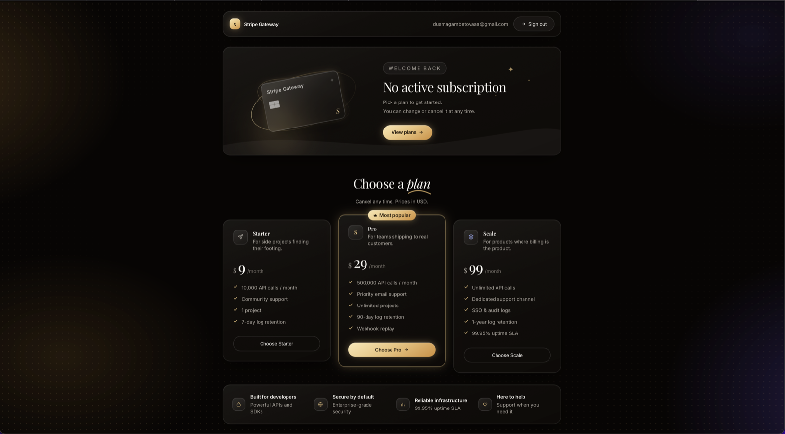
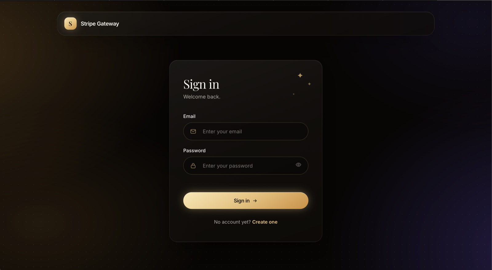
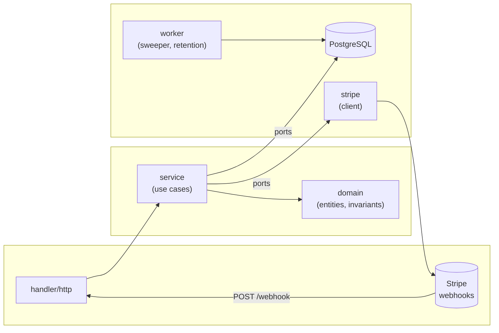
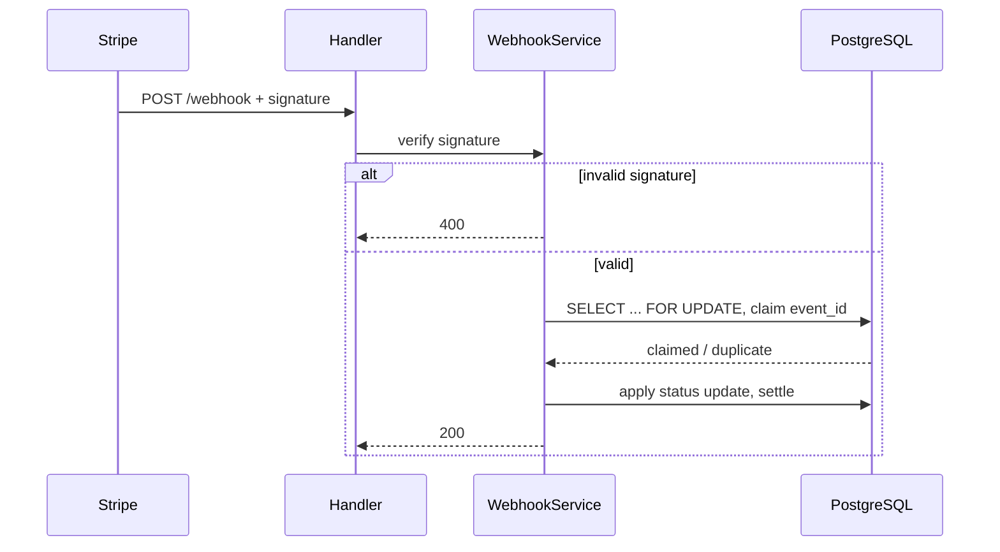

# Stripe Payment & Subscription Gateway

Billing service in Go: checkout, subscriptions, dunning, Customer Portal, React
dashboard.





**Go 1.25 · PostgreSQL 16 · pgx/v5 · chi · React 19 · Vite · Tailwind 4**

---

## Run it

```bash
cp .env.example .env      # Stripe test keys, and a JWT_SECRET
make up                   # postgres, migrations, api
```

Webhooks need a listener or nothing reaches the database:

```bash
stripe listen --forward-to localhost:8080/webhook
```

Paste the `whsec_` into `.env`, restart. Then:

```bash
cd web && cp .env.example .env && npm install && npm run dev
```

**Tests:**

```bash
make test                 # unit
make test-integration     # real PostgreSQL, in its own database
make verify-schema        # constraints, triggers, idempotency
```

219 tests, 75% combined coverage, gated in CI.

---

## Architecture

Modular monolith: one binary, one database, workers as goroutines. Dependencies
point inward only — `domain` imports nothing, everything else may import it.



Webhook lifecycle — verify, then claim, so a forged request can never plant a
row ahead of a real one:



Design notes: [docs/ARCHITECTURE.md](docs/ARCHITECTURE.md).

## What it guarantees

- **Out-of-order and duplicate webhooks converge to the correct state.** Row
  locks around the claim/settle path, not last-write-wins.
- **Nothing is trusted before its signature is verified.** Claim happens after
  verification, so a forged payload can't block a real delivery.
- **Invoice and subscription event streams don't starve each other.** Each
  stream gets its own cursor, so a burst on one never drops the other's status
  update.
- **Rate limiting never locks out the person being attacked.** Denials don't
  consume the reservation they were supposed to block.
- **Refresh token theft is detected, not just slowed down.** Reuse of a spent
  token revokes the whole token family.
- **Login timing doesn't leak which accounts exist.** The decoy path costs the
  same as a real check, generated at the configured bcrypt cost.
- **Failed webhooks get replayed automatically.** A sweeper reclaims crashed
  workers' claims and retries from the stored payload — Stripe stops retrying
  after three days, this doesn't.
- **Customer PII doesn't linger.** Stored payloads expire on a retention
  schedule (30/90 days) through an allowlisted field set, not a denylist.

Every guarantee above has a test that fails when the guarding code is removed.

---

## Layout

```
cmd/api                       composition root, shutdown, operator CLI
internal/domain               entities and invariants. No I/O.
internal/service              use cases
internal/repository/postgres  pgx adapters and their ports
internal/stripe               the only package importing stripe-go
internal/auth                 bcrypt, JWT, refresh tokens
internal/handler              routing, middleware, HTTP
internal/worker               sweeper, retention
internal/config               env to typed config, validated at boot
migrations                    schema, source of truth
web                           React dashboard
```

Four tables, six migrations. Every `down` is written and tested — a full reset
leaves nothing behind and CI checks it.

## Operate it

```
GET  /livez /healthz
POST /webhook
POST /api/v1/auth/register|login|refresh|logout
GET  /api/v1/auth/me
POST /api/v1/checkout  /api/v1/portal
GET  /api/v1/subscription
```

Liveness ignores the database, so a database outage doesn't turn into a
restart loop. `/metrics` sits on a separate listener; it publishes request
rates and business volume.

Two subcommands exit non-zero when a human is needed, so cron can call them:

```bash
api -webhook-report     # exits 2 on dead letters
api -retention-run      # exits 2 if data is overdue
```

`deployments/production` has a single-VPS compose stack — Caddy with automatic
TLS, API, Postgres, Prometheus. Caddy is the only container publishing ports.
